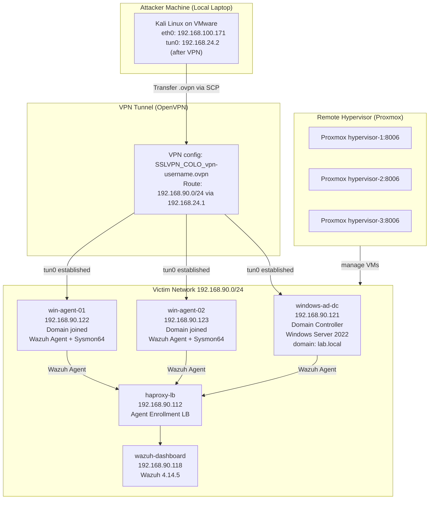
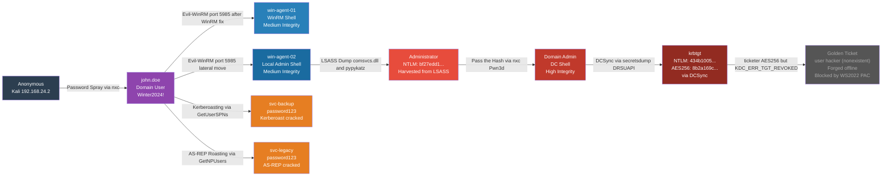
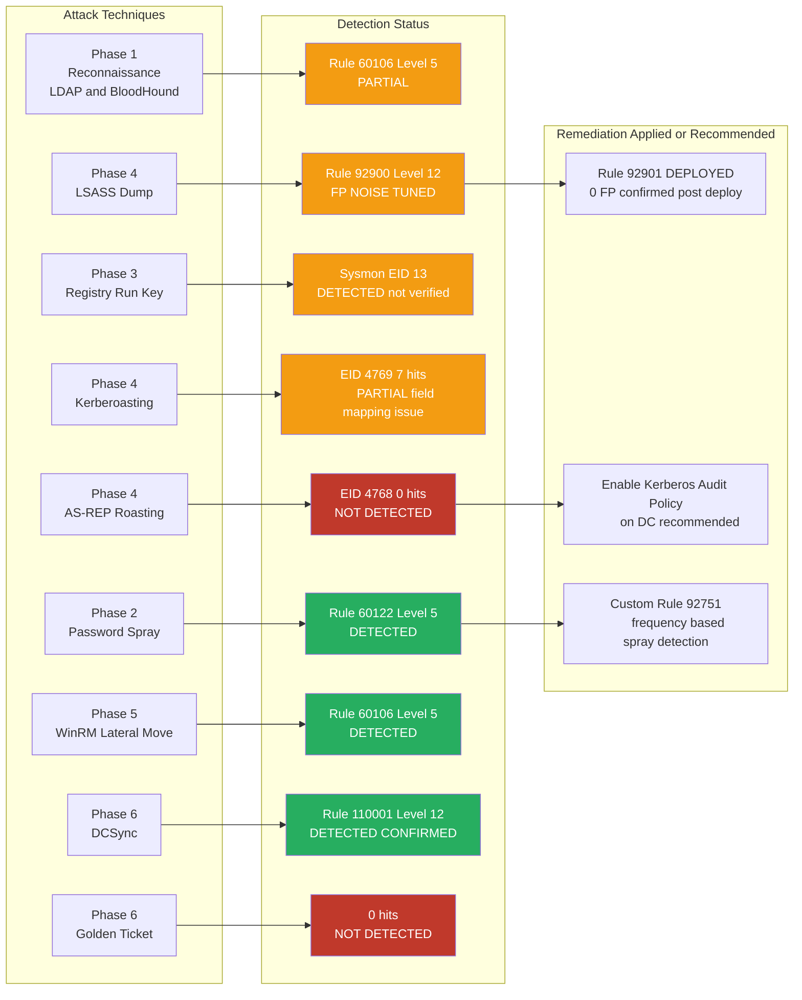

# Active Directory Red Team Detection Lab
## Full Kill Chain Simulation with Wazuh Blue Team Detection

**Author:** Dimas Qira Ramadhani | **Handle:** laborology
**Date:** June 19, 2026
**Domain:** lab.local | **SIEM:** Wazuh 4.14.5 Multi-Node
**GitHub:** github.com/dimasqiramadhani | **LinkedIn:** linkedin.com/in/dimasqiramadhani

---

## Project Overview

This project documents a full end-to-end red team simulation against an Active Directory environment using real-world attack techniques. Every attack phase is paired with blue team detection analysis via Wazuh SIEM, including rule tuning and detection gap identification. This documentation captures exactly what happened during the lab session, including errors, troubleshooting steps, and environment constraints.

---

## Lab Topology



---

## Vulnerable AD Objects

Created manually via PowerShell on the DC before starting the attack phases:

| Account | Vulnerability | Password | Detail |
|---|---|---|---|
| john.doe | Regular domain user (initial foothold) | Winter2024! | Created with New-ADUser |
| svc-backup | Kerberoastable | password123 | SPN: HTTP/backup.lab.local |
| svc-legacy | AS-REP Roastable | password123 | DoesNotRequirePreAuth = True via Set-ADAccountControl |

> Note: Initial passwords Backup2024! and Legacy2024! were not present in rockyou.txt so hashcat could not crack them. After disabling domain password complexity policy via secedit, passwords were reset to password123 which is a common rockyou entry.

---

## End-to-End Kill Chain Workflow

```mermaid
flowchart TD
    START([START
    Kali Linux
    192.168.100.171]) --> CONN

    subgraph P0["Phase 0: Connectivity Setup"]
        CONN["Enable SSH on Kali
        systemctl start ssh"]
        CONN --> SCP["SCP .ovpn from Windows host
        scp SSLVPN_COLO... root@192.168.100.171:~/"]
        SCP --> VPN["sudo openvpn config
        SSLVPN_COLO_vpn-username.ovpn"]
        VPN --> VERIFY["Verify:
        ip a show tun0
        ip route grep 192.168.90
        ping 192.168.90.121"]
        VERIFY --> DNS["Configure DNS:
        nameserver 192.168.90.121"]
    end

    DNS --> ADSETUP

    subgraph ADSETUP["AD Lab Setup (on DC via Proxmox Console)"]
        SETUP1["New-ADUser for john.doe, svc-backup, svc-legacy"]
        SETUP1 --> SETUP2["Set-ADUser svc-backup
        SPN: HTTP/backup.lab.local"]
        SETUP2 --> SETUP3["Set-ADAccountControl svc-legacy
        DoesNotRequirePreAuth true
        Note: Set-ADUserControl does not exist, use Set-ADAccountControl"]
    end

    ADSETUP --> RECON

    subgraph P1["Phase 1: Reconnaissance"]
        RECON["nmap scan ports 53,88,135,139,389,445,636,3268,3389,5985
        targets: 192.168.90.121 .122 .123"]
        RECON --> LDAP["ldapdomaindump
        auth: john.doe on ldap://192.168.90.121"]
        LDAP --> BH["bloodhound-python
        collect All, output zip"]
        BH --> RESULT1["Result: 7 users, 3 computers
        52 groups, 3 GPOs, 2 OUs"]
    end

    RESULT1 --> TOOLFIX

    subgraph TOOLFIX["Tooling Issue: crackmapexec Failed"]
        TOOLFIX1["apt install crackmapexec
        FAILED: python3-terminaltables3 404"]
        TOOLFIX1 --> TOOLFIX2["apt install netexec
        SUCCESS: nxc 1.5.1 installed"]
    end

    TOOLFIX --> SPRAY

    subgraph P2["Phase 2: Initial Access via Password Spray"]
        SPRAY["nxc smb 192.168.90.121
        users.txt with password Winter2024!
        continue on success"]
        SPRAY --> CRED1["john.doe:Winter2024! COMPROMISED
        All other 5 users: FAILED"]
    end

    CRED1 --> WINRMFIX

    subgraph WINRMFIX["WinRM Access Issue"]
        WINRMFIX1["evil-winrm to 192.168.90.122
        FAILED: WinRMAuthorizationError"]
        WINRMFIX1 --> WINRMFIX2["Fix on DC:
        Add-ADGroupMember Remote Management Users
        net localgroup add on agent directly"]
        WINRMFIX2 --> WINRMFIX3["gpupdate force and Restart-Service WinRM"]
    end

    WINRMFIX --> EXEC

    subgraph P3["Phase 3: Execution and Persistence on win-agent-01"]
        EXEC["evil-winrm to 192.168.90.122
        as john.doe
        SHELL ESTABLISHED"]
        EXEC --> PS["powershell EncodedCommand
        base64 whoami all
        SUCCESS"]
        PS --> SCHTASK["schtasks create with ru SYSTEM
        FAILED: Access is denied
        john.doe is not local admin"]
        SCHTASK --> REG["reg add HKCU Run key
        SUCCESS without admin rights"]
        REG --> AMSI["AMSI bypass via reflection
        AmsiUtils AmsiInitFailed
        SUCCESS"]
    end

    EXEC --> LAT_MOVE

    subgraph P5_EARLY["Phase 5 Start: Lateral to win-agent-02"]
        LAT_MOVE["evil-winrm to 192.168.90.123
        as john.doe
        SHELL ESTABLISHED"]
        LAT_MOVE --> CONFIRM["hostname: win-agent-02
        whoami: lab\\john.doe
        local admin: confirmed"]
    end

    CONFIRM --> CRED

    subgraph P4["Phase 4: Credential Access (from Kali and win-agent-02)"]
        CRED["Kerberoasting from Kali:
        GetUserSPNs targeting svc-backup
        output: krb5tgs hash"]
        CRED --> ASREP["AS-REP Roasting from Kali:
        GetNPUsers targeting svc-legacy
        output: krb5asrep hash"]
        ASREP --> HASHFIX["gunzip rockyou.txt.gz first
        hashcat modes 13100 and 18200"]
        HASHFIX --> HASHRESULT["svc-backup:password123 CRACKED in 0 seconds
        svc-legacy:password123 CRACKED in 0 seconds"]
        ASREP --> DEFOFF["Disable Defender on win-agent-02:
        Set-MpPreference DisableRealtimeMonitoring"]
        DEFOFF --> LSASS["rundll32 comsvcs.dll MiniDump
        dump lsass to C:\\temp\\lsass.dmp"]
        LSASS --> PYPYK["download lsass.dmp via Evil-WinRM
        pypykatz lsa minidump on Kali"]
        PYPYK --> RESULT4["Administrator NTLM:
        bf27edd1b8509ea3e5a081fe7b90564d"]
    end

    RESULT4 --> PTH

    subgraph P5_FULL["Phase 5 Complete: Pass the Hash to DC"]
        PTH["nxc smb 192.168.90.121
        admin with NTLM hash
        Result: Pwn3d!"]
    end

    PTH --> DOM

    subgraph P6["Phase 6: Domain Domination"]
        DOM["secretsdump with admin hash
        against DC 192.168.90.121
        all hashes dumped via DRSUAPI"]
        DOM --> AESKEY["secretsdump just-dc-user krbtgt
        retrieve AES256 key"]
        AESKEY --> SID["lookupsid to get Domain SID:
        S-1-5-21-2386780907-..."]
        SID --> GT["ticketer with AES256 krbtgt key
        forge ticket for user hacker
        non-existent in AD"]
        GT --> GTFAIL["psexec with forged ticket
        FAILED: KDC_ERR_TGT_REVOKED
        Windows Server 2022 PAC enforcement"]
        GTFAIL --> PTHSHELL["evil-winrm to DC
        admin with NTLM hash
        Domain Admin shell confirmed"]
        PTHSHELL --> RESULT6["lab\\administrator on windows-ad-dc
        Member of Domain Admins and Enterprise Admins
        High Mandatory Level
        FULLY COMPROMISED"]
    end

    RESULT6 --> BLUE

    subgraph BLUE["Blue Team: Wazuh Detection Review"]
        B1["OpenSearch Dev Tools queries
        aggregation by event ID and rule ID"]
        B1 --> B2["4625 x7: password spray events
        4662 x30: DCSync events
        4769 x7: Kerberoasting partial
        EID 10 x5: LSASS access FP from Defender"]
        B2 --> B3["Deploy rule 92901:
        suppress MsMpEng.exe false positives
        systemctl restart wazuh-manager"]
        B3 --> B4["Verify: 0 hits for rule 92900
        after restart timestamp
        rule tuning confirmed effective"]
    end

    BLUE --> END([END
    Domain Compromised
    Detection Gaps Documented])

    style START fill:#2d2d2d,color:#fff
    style END fill:#c0392b,color:#fff
    style P0 fill:#1a3a1a,color:#fff
    style ADSETUP fill:#1a2a3a,color:#fff
    style TOOLFIX fill:#2a1a2a,color:#fff
    style WINRMFIX fill:#2a1a2a,color:#fff
    style P1 fill:#16213e,color:#fff
    style P2 fill:#0f3460,color:#fff
    style P3 fill:#533483,color:#fff
    style P4 fill:#6b1a1a,color:#fff
    style P5_EARLY fill:#0f3460,color:#fff
    style P5_FULL fill:#0f3460,color:#fff
    style P6 fill:#c0392b,color:#fff
    style BLUE fill:#1a3a1a,color:#fff
```



---

## Attack Path and Privilege Escalation



---

## Wazuh Detection Coverage



---

## Nmap Port Access Summary

| Port | Service | DC 192.168.90.121 | Agent 192.168.90.122 | Agent 192.168.90.123 |
|---|---|---|---|---|
| 53 | DNS | OPEN | FILTERED | FILTERED |
| 88 | Kerberos | OPEN | FILTERED | FILTERED |
| 135 | MSRPC | OPEN | FILTERED | FILTERED |
| 139 | NetBIOS | OPEN | FILTERED | FILTERED |
| 389 | LDAP | OPEN | FILTERED | FILTERED |
| 445 | SMB | OPEN | FILTERED | FILTERED |
| 636 | LDAPS | OPEN | FILTERED | FILTERED |
| 3268 | GC LDAP | OPEN | FILTERED | FILTERED |
| 3389 | RDP | OPEN | OPEN | OPEN |
| 5985 | WinRM | OPEN | OPEN | OPEN |

SMB port 445 and RPC port 135 are filtered on both agents. This rules out PsExec and WMIExec as lateral movement options. WinRM on port 5985 is the only viable remote execution path to the agents besides RDP.

---

## Kill Chain Summary Table

| Phase | Technique | MITRE | Tools | Actual Result |
|---|---|---|---|---|
| Phase 0 | Connectivity | N/A | OpenVPN | tun0 192.168.24.2, RTT 22ms to DC |
| AD Setup | Lab Preparation | N/A | PowerShell on DC | 3 vulnerable users created, Set-ADAccountControl used |
| Phase 1 | Reconnaissance | T1046 T1087.002 T1069.002 | nmap ldapdomaindump bloodhound-python | 7 users 3 computers 52 groups dumped |
| Phase 2 | Password Spray | T1110.003 | netexec 1.5.1 (crackmapexec failed) | john.doe:Winter2024! compromised |
| Phase 3 | Exec and Persistence | T1059.001 T1547.001 T1562.001 | evil-winrm after WinRM fix | Shell on win-agent-01, HKCU Run key, AMSI bypass |
| Phase 3 | Scheduled Task (failed) | T1053.005 | schtasks | Access denied, john.doe not local admin |
| Phase 4 | Kerberoasting | T1558.003 | GetUserSPNs hashcat | svc-backup:password123 cracked in 0 seconds |
| Phase 4 | AS-REP Roasting | T1558.004 | GetNPUsers hashcat | svc-legacy:password123 cracked in 0 seconds |
| Phase 4 | LSASS Dump | T1003.001 | comsvcs.dll pypykatz | Administrator NTLM bf27edd1 harvested |
| Phase 5 | Lateral via WinRM | T1021.006 | evil-winrm | Shell on win-agent-02 as local admin |
| Phase 5 | Pass the Hash | T1550.002 | nxc smb | Pwn3d on DC |
| Phase 6 | DCSync | T1003.006 | secretsdump | All 9 domain account hashes dumped |
| Phase 6 | Golden Ticket | T1558.001 | ticketer AES256 | Forged but blocked by KDC_ERR_TGT_REVOKED |
| Phase 6 | DA Shell | N/A | evil-winrm PtH | lab\\administrator on windows-ad-dc confirmed |
| Blue Team | Detection Review | N/A | OpenSearch Dev Tools | 4 confirmed 2 partial 3 gaps identified |
| Blue Team | Rule Tuning | N/A | Wazuh manager rules | Rule 92901 deployed, 0 FP verified |

---

## Wazuh Detection Summary (Confirmed Evidence)

| Phase | Rule ID | Event ID | Level | Status | Evidence |
|---|---|---|---|---|---|
| Phase 2 | 60122 | 4625 | 5 | DETECTED | 7 events from 192.168.24.2 |
| Phase 4 | 92900 | EID 10 | 12 | FP TUNED | 16 FP before, 0 after rule 92901 |
| Phase 4 | N/A | 4769 | N/A | PARTIAL | 7 hits but encryption field mapping differs |
| Phase 4 | N/A | 4768 | N/A | NOT DETECTED | 0 hits due to audit policy gap |
| Phase 6 | 110001 | 4662 | 12 | DETECTED | 20 events mail true confirmed |

---

## Troubleshooting Log

Everything that went wrong during this session, in rough order of occurrence.

| Issue | Root Cause | Resolution |
|---|---|---|
| ldapdomaindump auth failed | john.doe did not exist in AD yet | AD setup needed to happen before recon |
| bloodhound-python Kerberos error | KDC_ERR_C_PRINCIPAL_UNKNOWN for john.doe | bloodhound-python fell back to NTLM automatically, collection still worked |
| Set-ADUserControl not found | Cmdlet does not exist in PowerShell | Replace with Set-ADAccountControl |
| crackmapexec installation failed twice | python3-terminaltables3 4.0.0-7 removed from repo | apt update then apt install netexec |
| hashcat rockyou.txt not found | Wordlist still compressed | gunzip /usr/share/wordlists/rockyou.txt.gz |
| First hashcat attempt exhausted | Backup2024! and Legacy2024! not in rockyou | Reset service account passwords on DC |
| password123 rejected by DC | Domain password complexity policy active | Disable complexity via secedit and net accounts |
| Evil-WinRM shell opened then immediately dropped | john.doe not in Remote Management Users group | Add to AD group and directly to local group on agent, restart WinRM |
| schtasks access denied twice | Medium Mandatory Level via WinRM insufficient | Abandoned this technique, registry persistence used instead |
| Golden Ticket attempt 1 failed | NTLM-based ticket rejected by WS2022 | Retried with AES256 key |
| Golden Ticket attempt 2 failed | AES256 ticket still KDC_ERR_TGT_REVOKED | Tried disabling PAC validation on DC |
| PAC validation disable did not help | WS2022 enforces multiple validation layers | Golden Ticket abandoned, used Pass the Hash instead |
| windows_custom_rules.xml broke Wazuh manager | Rule element not wrapped in group tag | Added group wrapper, restarted successfully |

---

## Project Structure

```
ad-redteam-lab/
├── README.md
├── docs/
│   ├── 00-connectivity-setup.md
│   ├── 01-phase1-reconnaissance.md
│   ├── 02-phase2-initial-access.md
│   ├── 03-phase3-execution.md
│   ├── 04-phase4-credential-access.md
│   ├── 05-phase5-lateral-movement.md
│   ├── 06-phase6-domain-domination.md
│   └── 07-wazuh-detection-report.md
├── rules/
│   ├── windows_custom_rules.xml
│   └── windows_redteam_detection.xml
├── scripts/
│   ├── setup-ad-objects.ps1
│   └── enable-audit-policy.ps1
└── evidence/
    └── wazuh-detection-summary.md
```

---

## Tools Used

Red Team: nmap 7.99, ldapdomaindump, bloodhound-python 1.9.0, netexec nxc 1.5.1, evil-winrm 3.9, impacket 0.14.0, pypykatz, hashcat 7.1.2

Blue Team: Wazuh 4.14.5 Multi-Node Cluster, Sysmon64 with Olaf Hartong config, OpenSearch Dev Tools

Lab Management: Proxmox VE on remote hypervisors, OpenVPN

---

## Key Findings

1. DCSync was the clearest detection. Rule 110001 fired at level 12 with mail alert, generating 20 events when secretsdump ran. This is one of the strongest built-in detection rules in the lab.
2. Golden Ticket failed completely despite three attempts. NTLM-based forge, AES256-based forge with extra SIDs, and disabling PAC validation on the DC via registry all produced KDC_ERR_TGT_REVOKED. Windows Server 2022 rejects file-based ccache tickets through multiple layers. In a real engagement this would require Mimikatz executing in memory on a domain-joined machine.
3. LSASS false positives masked the actual dump. Rule 92900 was firing 16 times daily from MsMpEng.exe before rule 92901 was deployed. The actual rundll32 dump event was not definitively confirmed distinct from that noise during the session.
4. AS-REP Roasting produced zero events. The Kerberos Authentication Service audit subcategory was not enabled on the DC, so event 4768 was never generated. The attack succeeded technically but left no trace in Wazuh.
5. Kerberoasting was visible but not actionable. Seven 4769 events were ingested but custom rule 92755 did not fire because the field name for ticketEncryptionType differs in this Wazuh version.
6. crackmapexec could not be installed. The required dependency python3-terminaltables3 version 4.0.0-7 was missing from the Kali repo. The entire password spray phase depended on first switching to netexec.
7. SMB being filtered on agents forced a different lateral movement path. PsExec and WMIExec both timed out. WinRM was the only working remote execution channel to the agents.
8. The Wazuh rule XML failed on first deployment. The rules file was missing the group wrapper element, causing wazuh-manager to refuse to start. This was caught immediately and fixed.

---

> Portfolio: laborology | dimasqiramadhani@gmail.com | github.com/dimasqiramadhani | wa.me/6282254331579
