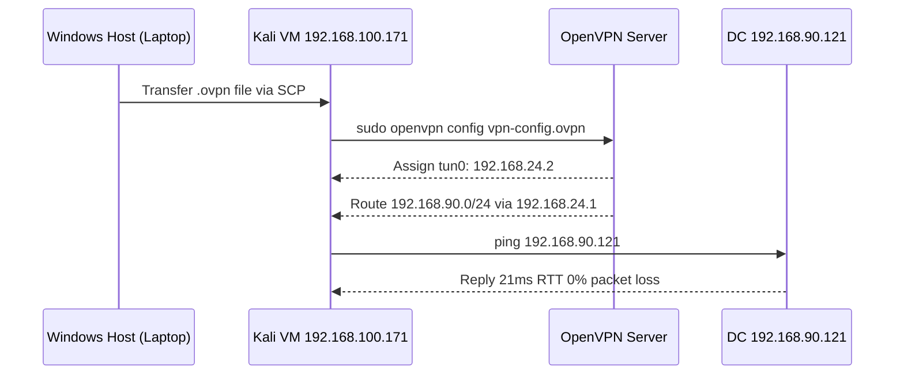

# Phase 0: Connectivity Setup

## Overview



## Situation

The Kali Linux VM lives on the local laptop with a VMware NAT address of 192.168.100.171. The victim network sits on a remote server at 192.168.90.0/24. An OpenVPN client profile is required to reach the victim subnet.

## Step 1: Enable SSH on Kali

```bash
sudo systemctl start ssh
sudo systemctl status ssh
ss -tlnp | grep 22
```

## Step 2: Transfer the .ovpn File to Kali

Option A via SCP (recommended):

```powershell
# From Windows PowerShell, replace path and IP as needed
scp "C:\path\to\vpn-config.ovpn" root@192.168.100.171:~/
```

Option B via Python HTTP server:

```powershell
# On Windows, navigate to the folder containing the .ovpn file
cd "C:\path\to\vpn-folder"
python -m http.server 8888
```

```bash
# On Kali
wget http://<windows-host-ip>:8888/vpn-config.ovpn
```

## Step 3: Connect to VPN

```bash
sudo openvpn --config ~/vpn-config.ovpn
# Enter VPN username and password when prompted
# Wait for: Initialization Sequence Completed
```

## Step 4: Verify Connectivity

```bash
# Check that tun0 interface is up
ip a show tun0

# Confirm route to victim subnet
ip route | grep 192.168.90

# Ping the Domain Controller
ping -c 3 192.168.90.121
```

Actual output from this lab session:

```
tun0: inet 192.168.24.2/24 brd 192.168.24.255
Route: 192.168.90.0/24 via 192.168.24.1 dev tun0
Ping DC: 3 packets transmitted, 3 received, 0% packet loss, avg 22.1ms
```

## Step 5: Configure DNS

```bash
echo "nameserver 192.168.90.121" > /etc/resolv.conf
nslookup lab.local
# Expected: answer from 192.168.90.121
```

## Step 6: Update /etc/hosts

```bash
sudo tee -a /etc/hosts << 'EOF'
192.168.90.121  windows-ad-dc.lab.local windows-ad-dc lab.local
192.168.90.122  win-agent-01.lab.local win-agent-01
192.168.90.123  win-agent-02.lab.local win-agent-02
EOF
```

## Port Access Matrix from Nmap Scan

| Port | Service | DC 192.168.90.121 | Agent 192.168.90.122 | Agent 192.168.90.123 |
|---|---|---|---|---|
| 53 | DNS | OPEN | FILTERED | FILTERED |
| 88 | Kerberos | OPEN | FILTERED | FILTERED |
| 135 | MSRPC | OPEN | FILTERED | FILTERED |
| 139 | NetBIOS | OPEN | FILTERED | FILTERED |
| 389 | LDAP | OPEN | FILTERED | FILTERED |
| 445 | SMB | OPEN | FILTERED | FILTERED |
| 636 | LDAPS | OPEN | FILTERED | FILTERED |
| 3268 | GC LDAP | OPEN | FILTERED | FILTERED |
| 3389 | RDP | OPEN | OPEN | OPEN |
| 5985 | WinRM | OPEN | OPEN | OPEN |

VPN routing is one-directional. The victim machines cannot initiate connections back to Kali. SMB and RPC are filtered on both agents, which means PsExec and WMIExec will not work directly against agents. WinRM on port 5985 is the only remote execution path available on agents besides RDP.
