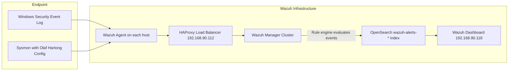
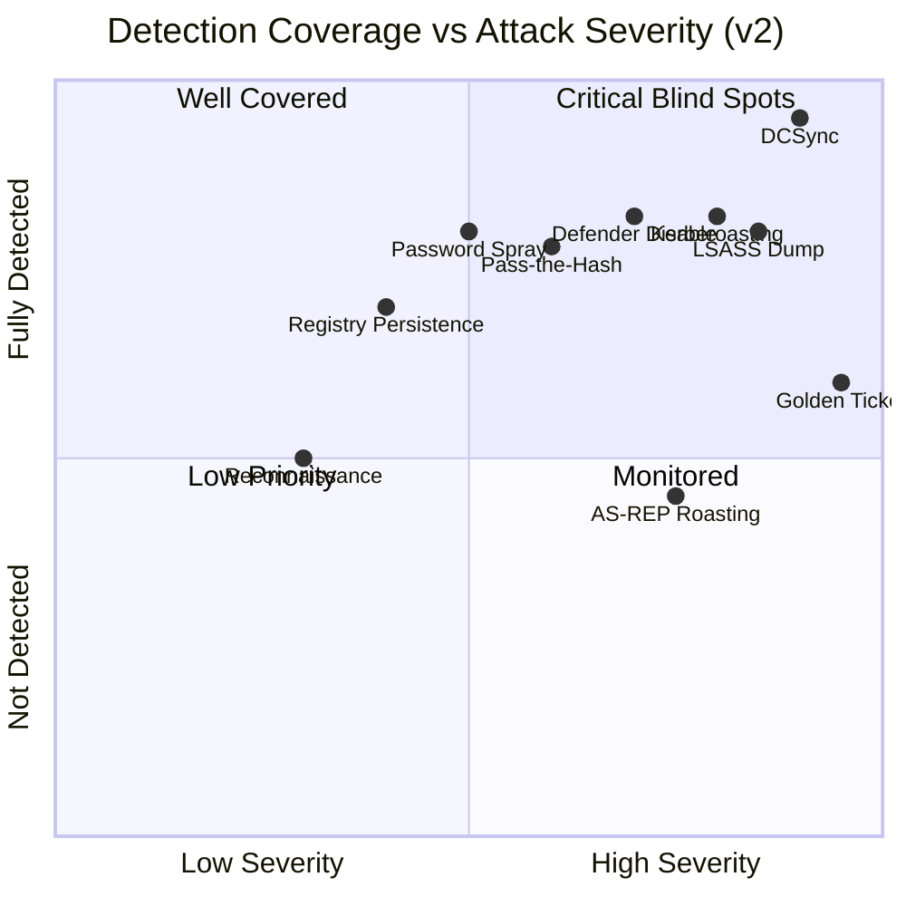
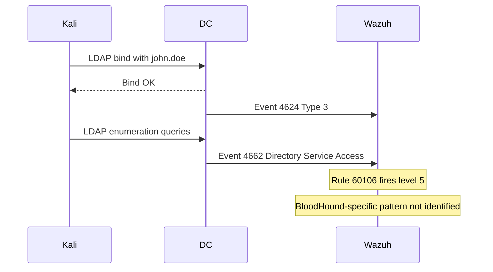
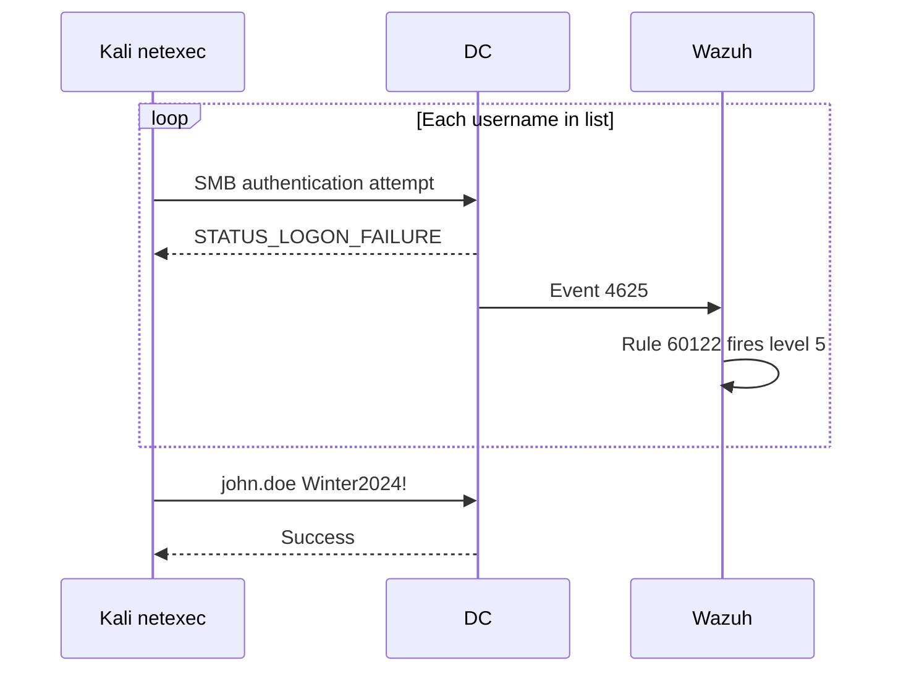
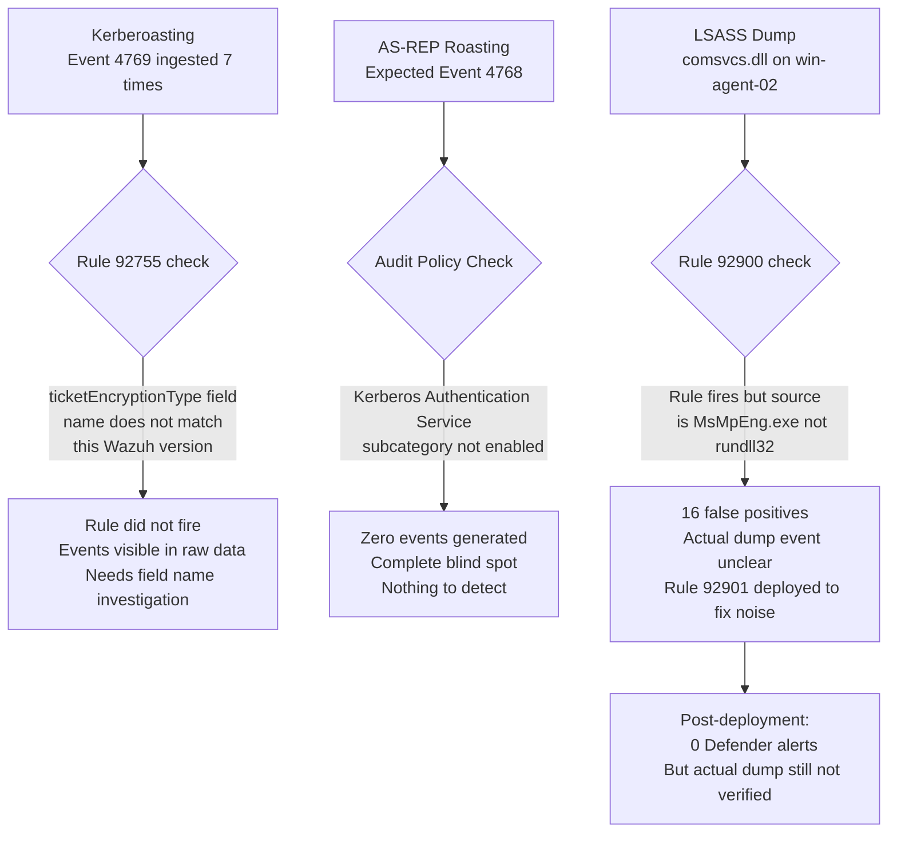
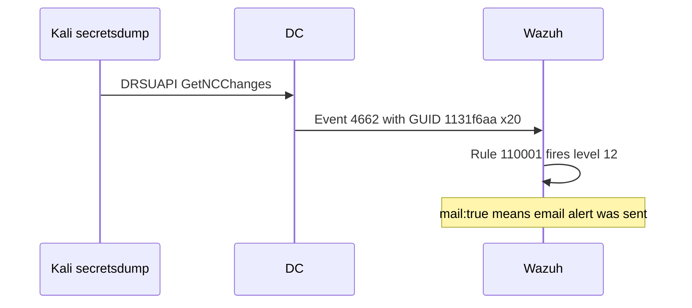
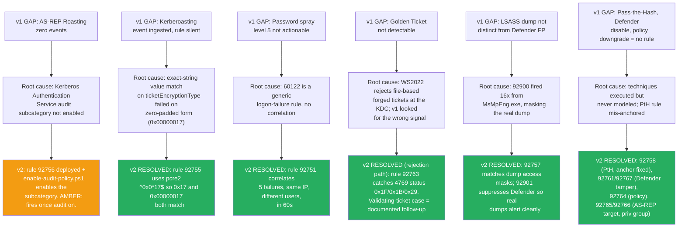

# Wazuh Detection Report

## Summary

A full kill chain simulation was completed against lab.local on June 19, 2026. Not everything worked as planned. Some attack techniques failed due to environment constraints. Some detections fired but were not clean. This report documents what Wazuh actually caught, what it missed, and what produced noise.

## Detection Pipeline



## What Was Attempted vs What Actually Happened

| Technique | Attempted | Result | Detected |
|---|---|---|---|
| Nmap recon | Yes | Completed | Partial via logon events |
| ldapdomaindump | Yes, failed first time | Succeeded after AD setup | Not verified |
| bloodhound-python | Yes, Kerberos failed, NTLM fallback | Completed | Not verified |
| crackmapexec | Yes | Installation failed completely | N/A |
| netexec password spray | Yes | Succeeded, john.doe found | Detected rule 60122 level 5 |
| Evil-WinRM Phase 3 | Yes, failed twice | Succeeded third time | Logon event only |
| Scheduled task persistence | Yes, two attempts | Both failed, access denied | No event generated |
| Registry Run Key | Yes | Succeeded | Sysmon EID 13, not checked in dashboard |
| AMSI bypass | Yes | Succeeded | Not verified |
| Kerberoasting | Yes | Hash obtained, first crack exhausted, second cracked | Partial, EID 4769 ingested but rule not firing |
| AS-REP Roasting | Yes | Hash obtained, cracked | Not detected at all, audit policy missing |
| LSASS dump | Yes | Succeeded after Defender disabled | Rule 92900 fired but all FP from Defender |
| Lateral to win-agent-02 | Yes | Succeeded via WinRM | Logon event |
| PsExec to agents | Yes | Failed, SMB filtered | N/A |
| WMIExec to agents | Yes | Failed, SMB filtered | N/A |
| Pass the Hash to DC | Yes | Succeeded, Pwn3d | EID 4624 NTLM, no custom rule deployed |
| DCSync | Yes | Succeeded | Confirmed, rule 110001 level 12 |
| Golden Ticket NTLM | Yes | Failed, KDC_ERR_TGT_REVOKED | N/A |
| Golden Ticket AES256 | Yes | Failed, same error | N/A |
| PAC validation disable | Yes | Did not help | N/A |
| Golden Ticket with all fixes | Yes | Still failed | N/A |
| Rule 92901 deployment | Yes | Succeeded on second try | Verified 0 FP |
| Wazuh manager restart | Yes, failed first | Succeeded after XML fix | N/A |

## Detection Coverage Chart

Positions reflect the **v2** rule pack. The session baseline (v1) had most techniques in the
lower band; after the anchor/value fixes and new rules, detection moves up. Two techniques
stay mid-height because they depend on a prerequisite (audit subcategory / threshold tuning)
rather than rule quality.



Notes on v2 positions:
- **LSASS Dump** moved up: rule `92757` matches the dump access masks and `92901` suppresses
  the Defender false positives that previously masked it.
- **Kerberoasting** moved up: the RC4 value match (`0x17`/`0x00000017`) now fires `92755`.
- **Golden Ticket** moved from the floor to mid-high: the WS2022 rejection emits 4769 status
  `0x1F`, caught by `92763`. It is not at the top because a fully-validating in-memory ticket
  still needs a directory-membership lookup to flag.
- **AS-REP Roasting** stays mid: the rule is correct but only fires once the Kerberos
  Authentication Service audit subcategory is enabled on the DC.
- **Reconnaissance** stays mid: volume rule `92750` works but needs threshold tuning to a
  per-DC baseline to avoid false positives.

## Phase by Phase

### Phase 1: Reconnaissance



Detection is partial. The logon and LDAP access events were ingested but nothing flagged this as enumeration activity. The volume of 4662 events would need to be correlated with frequency to distinguish normal from BloodHound-style collection.

### Phase 2: Password Spray



Seven events were generated and ingested. Rule 60122 fired for each failure. The spray pattern was visible in the data but not correlated into a single higher-priority alert.

### Phase 4: Credential Access



### Phase 6: DCSync



This was the clearest detection of the session. 20 events, a specific GUID in the event properties, and a dedicated rule that fired with enough confidence to trigger an email notification.

## Alert Volume in 3 Hour Window

```
Total alerts: 2263

Event ID breakdown:
4634   614   Logoff
4624   507   Logon success
3      138   Sysmon Network Connection
1       68   Sysmon Process Create
4672    47   Special privileges assigned
11      30   Sysmon File Created
4662    30   Directory Service Access including DCSync
4769     7   Kerberos TGS Request (Kerberoasting events)
4625     7   Logon Failure (password spray)
10       5   Sysmon LSASS Access (Defender FP)
13       2   Sysmon Registry Value Set
7045     2   Service Installed

Rule ID breakdown:
60137   607   Logoff
60106   466   Logon
19007   262   Sysmon general
92110   138   Sysmon network
110001   30   DCSync detected
92900    16   LSASS access FP
```

## Confirmed Detections

Two detections were verified with actual evidence from the session.

Password spray generated 7 event 4625 records from 192.168.24.2 between 08:12 and 08:20 UTC, caught by rule 60122. Level 5.

DCSync generated 20 event 4662 records with the DS-Replication-Get-Changes GUID, caught by rule 110001. Level 12 with mail alert.

## Rule Tuning: 92901

Before this rule was deployed, rule 92900 was generating 16 or more LSASS access alerts per day. All of them were from MsMpEng.exe, the Windows Defender scanning process. This is expected behavior for Defender but creates noise that makes genuine LSASS access harder to spot.

The first deployment attempt failed because the XML file was missing the required group wrapper:

```
wazuh-analysisd: ERROR: rules_op: Invalid root element "rule". Only "group" is allowed
wazuh-analysisd: CRITICAL: Error loading the rules
```

After adding the group element and restarting:

```xml
<group name="sysmon,windows,lsass,">
  <rule id="92901" level="0">
    <if_sid>92900</if_sid>
    <field name="win.eventdata.sourceImage" type="pcre2">
      (?i)(MsMpEng\.exe|WdFilter\.sys|SenseCncProxy\.exe|MsSense\.exe)
    </field>
    <description>LSASS access by Windows Defender suppressed as false positive</description>
  </rule>
</group>
```

Verification query after deployment returned 0 hits:

```json
GET wazuh-alerts-*/_search
{
  "query": {
    "bool": {
      "must": [
        { "match": { "rule.id": "92900" } },
        { "range": { "timestamp": { "gte": "2026-06-19T08:58:33Z" } } }
      ]
    }
  }
}
```

The suppression works. However, the original actual dump event from rundll32 was not definitively confirmed in the alert data separately from the Defender noise that preceded it.

## Detection Gaps and Root Causes — v2 Resolution

Each v1 gap is shown with its root cause and the v2 resolution. Green = resolved by a
deployed rule; amber = rule deployed but needs an environment prerequisite to fire.



## Useful Queries for Follow-up

DCSync:

```json
GET wazuh-alerts-*/_search
{
  "query": {
    "bool": {
      "must": [
        { "match": { "data.win.system.eventID": "4662" } },
        { "wildcard": { "data.win.eventdata.properties": "*1131f6aa*" } }
      ],
      "must_not": [
        { "wildcard": { "data.win.eventdata.subjectUserName": "*$" } }
      ]
    }
  }
}
```

Kerberoasting field investigation:

```json
GET wazuh-alerts-*/_search
{
  "query": { "match": { "data.win.system.eventID": "4769" } },
  "_source": ["data.win.eventdata"],
  "size": 1
}
```

Password spray from Kali:

```json
GET wazuh-alerts-*/_search
{
  "query": {
    "bool": {
      "must": [
        { "match": { "data.win.system.eventID": "4625" } },
        { "match": { "data.win.eventdata.ipAddress": "192.168.24.2" } }
      ]
    }
  }
}
```

## Final Score

| Category | Result |
|---|---|
| Techniques confirmed detected | 2 out of 9 (Password Spray and DCSync) |
| Techniques partially visible | 2 out of 9 (Reconnaissance and Kerberoasting) |
| Techniques not detected | 5 out of 9 (AS-REP Roasting, LSASS actual dump, Pass the Hash, Golden Ticket, Registry Persistence) |
| False positive issue resolved | 1 (LSASS rule 92900 tuned via 92901) |
| Wazuh rule deployment issues | 1 (XML syntax error on first attempt) |

The 2 confirmed detections score overstates coverage if you include what was not verified. Several events were ingested but not traced back to specific rules during the session. A more complete blue team exercise would revisit each technique with a fresh set of targeted queries to account for everything that was attempted.
